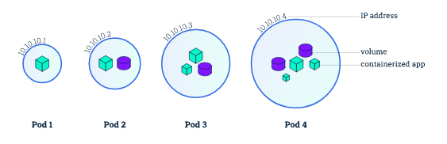
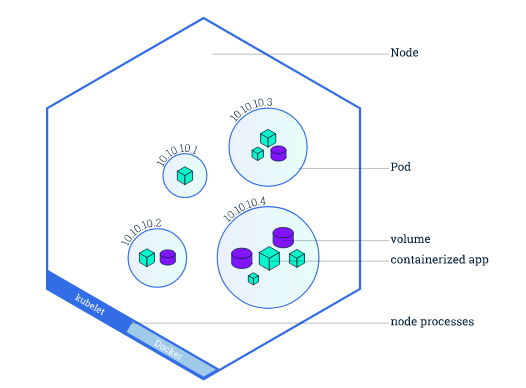
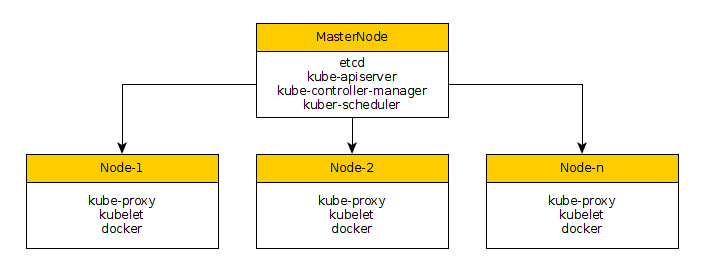

# Kubernetes Basico

<!-- TOC -->

- [Kubernetes Basico](#kubernetes-basico)
    - [A. Introducción](#a-introducción)
        - [MasterNode (Nodo Maestro)](#masternode-nodo-maestro)
        - [Los Nodos](#los-nodos)
    - [B. HelloWorld Kubernetes](#b-helloworld-kubernetes)
    - [C. Un poco de teoria](#c-un-poco-de-teoria)
        - [PODS](#pods)
        - [Nodo (Ojo No el Master)](#nodo-ojo-no-el-master)
    - [D. HelloWorld Kubernetes (paso 2).](#d-helloworld-kubernetes-paso-2)
    - [E. HelloWorld (es hora de lo chevere)](#e-helloworld-es-hora-de-lo-chevere)
    - [F. Instalación Software](#f-instalación-software)
        - [Instalación de Paquetes para Master](#instalación-de-paquetes-para-master)
        - [Instalación de Paquetes para Nodo](#instalación-de-paquetes-para-nodo)
        - [Iniciar Servicios de NTP para todos los nodos](#iniciar-servicios-de-ntp-para-todos-los-nodos)
    - [G. Configurar Master](#g-configurar-master)
        - [Activamos Servicios y los iniciamos](#activamos-servicios-y-los-iniciamos)
    - [H. Configurar KNode](#h-configurar-knode)
        - [Activamos Servicios y los iniciamos](#activamos-servicios-y-los-iniciamos-1)

<!-- /TOC -->

## A. Introducción 

Con los servicios web modernos, los usuarios esperan que las aplicaciones estén disponibles las 24 horas del día, los 7 días de la semana, y los desarrolladores esperan implementar nuevas versiones de esas aplicaciones varias veces al día. La contenedorización ayuda al software del paquete a cumplir estos objetivos, permitiendo que las aplicaciones se publiquen y actualicen de una manera fácil y rápida sin tiempo de inactividad. Kubernetes le ayuda a asegurarse de que esas aplicaciones en contenedores se ejecuten en el lugar y el momento que desee, y los ayuda a encontrar los recursos y las herramientas que necesitan para trabajar. Kubernetes es una plataforma de código abierto lista para la producción diseñada con la experiencia acumulada de Google en la orquestación de contenedores, combinada con las mejores ideas de la comunidad.

```bash
Conceptos Claves 

Kubernetes coordina un grupo de computadoras altamente disponibles que están conectadas para funcionar como una sola unidad

Kubernetes automatiza la distribución y la programación de contenedores de aplicaciones en un clúster de una manera más eficiente

```

Un clúster de Kubernetes consta de dos tipos de recursos:
1. El **maestro** (master) coordina el clúster
1. Los **nodos** son los trabajadores que ejecutan aplicaciones


### MasterNode (Nodo Maestro)
- Coordina todas las actividades de su clúster, como programar aplicaciones.
- Mantener el estado deseado de las aplicaciones
- Escalar aplicaciones 
- Desplegar nuevas actualizaciones

### Los Nodos 
- Cada nodo tiene un Kubelet, que es un agente para administrar el nodo y comunicarse con el maestro de Kubernetes
- El nodo también debe tener herramientas para manejar operaciones de contenedor, como Docker
- Un clúster de Kubernetes que maneja el tráfico de producción debe tener un mínimo de tres nodos.

## B. HelloWorld Kubernetes

Minikube es una herramienta que hace que sea fácil ejecutar Kubernetes localmente. Minikube ejecuta un clúster de Kubernetes de un nodo dentro de una máquina virtual en su computadora portátil para los usuarios que buscan probar Kubernetes o desarrollar con él día a día,  La CLI de Minikube proporciona operaciones básicas de arranque para trabajar con su clúster, incluido inicio, detención, estado y eliminación.


**Inciamos un cluster de minikube**

```bash
minikube start
```

El resultado sera
```bash
jgaviria@argos [~] $ minikube start
Starting local Kubernetes v1.10.0 cluster...
Starting VM...

Getting VM IP address...
Moving files into cluster...
Setting up certs...
Connecting to cluster...
Setting up kubeconfig...
Starting cluster components...
Kubectl is now configured to use the cluster.
Loading cached images from config file.

```

Dada que la gran cantidad de operaciones, las realiza siempre el nodo master, contaremos en este pequeño HelloWorld con capacidades en nuestra maquina para tener ciertos comandos del Master, como son el comando kubectl (controls the Kubernetes cluster manager). 

Ahora una vez inciado nuestro "pequeño cluster", vamos a solicitar información del mismo "kubectl cluster-info"

```bash
jgaviria@argos [~] $ kubectl cluster-info
Kubernetes master is running at https://192.168.99.100:8443
KubeDNS is running at https://192.168.99.100:8443/api/v1/namespaces/kube-system/services/kube-dns:dns/proxy
```

Y para saber que Nodos (trabajadores), voy a tener ejecuto "kubectl get nodes"

```bash
jgaviria@argos [~] $ kubectl get nodes
NAME       STATUS    ROLES     AGE       VERSION
minikube   Ready     master    22m       v1.10.0

```

Ya con mi cluster iniciado, vamos a realizar la creación de una aplicación.  El Despliegue le indica a Kubernetes cómo crear y actualizar instancias de su aplicación. Una vez que haya creado una implementación, Kubernetes programa las instancias de aplicación mencionadas en nodos individuales en el clúster.  Controlador de Despliegue de Kubernetes monitorea continuamente esas instancias. Si el nodo que aloja una instancia deja de funcionar o se elimina, el controlador de implementación lo reemplaza. Esto proporciona un mecanismo de autocuración para abordar la falla o el mantenimiento de la máquina.

Para crear un nuevo despliegue y ejecutarlo vamos a ejecutar el comando "kubectl run", su sinxtaxis es 

kubectl run [NombreDespliegue] --image=[Url de la Imagen docker] --port [Puerto] --image-pull-policy=Never

Usamos el flag "image-pull-policy" en "Never" para que siempre utilice nuestras imagenes locales, de lo contrario r

Para hacer un ejemplo chevere vamos a crear una imagen de docker que ejecute una app de NodeJS que simplemente nos salude, para esto construimos el programa de NodeJS y el DockerFile que lo contendra

server.js
```javascript
var http= require('http');
var os= require('os');

var handleRequest= function(request, response) {
    response.writeHead(200);
    response.end('Hola Mundo desde el Host [' + os.hostname() + ']');
};

var www= http.createServer(handleRequest);
www.listen(8080);
console.log('Servidor iniciado en ' + os.hostname() + ":8080");
```

Ahora creamos el Dockerfile para crear una imagen con este programa NodeJS

Dockerfile
```javascript
FROM node
COPY server.js .
EXPOSE 8080
CMD [ "node", "server.js" ]  
```

Ahora antes de crear nuestra imagen y ejecutar el deployment, seteamos las variables de ambiente de Minikube (para que fuerze que que el DOCKER_HOST) sea nuestra maquina y no vaya a buscar en el DockerHub, con el comando. 
De esta forma 

```javascript
eval $(minikube docker-env)
```


Ahora simplemente creamos nuestra imagen para colocarla en nuestro repositorio local

```javascript
docker build -t hello-world:v1 .
```


Ahora vamos a ejecutar nuestro despliegue en uno de los nodos de Kubernetes, para lo cual ejecutamos
```bash
jgaviria@argos [~] $ kubectl run hello-world --image=hello-world:v1 --port 8080 --image-pull-policy=Never
deployment.apps/hello-world created

```

Para eliminar nuestra despliegue (por si nos equivocamos), usamos el comando 
kubectl delete deployment [Nombre Despliegue] 

```javascript
kubectl delete deployment hello-world
```
*Esto elimina tanto el despliegue como los componentes referenciados (como el Pod


Para ver llos despliegues disponibles ejucutamos "kubectl get deployments"
```bash

jgaviria@argos [~] $ kubectl get deployments
NAME          DESIRED   CURRENT   UP-TO-DATE   AVAILABLE   AGE
hello-world   1         1         1            1           1m
```

Una aplicación se ejecuta dentro de un componente basico llamado "Pod", un pod es nuestra imagen en ejecución y se ejcuta en un dirección interna que no puede ser accedido de forma directa, para ver los pods en ejecución, simplemente ejecuto 

```javascript
jgaviria@argos [~/k8s-helloworld] $ kubectl get pods
NAME                           READY     STATUS    RESTARTS   AGE
hello-world-7675d97975-d5jpk   1/1       Running   0          19s
```

Podemos ver que esta habiendo este POD ejcutando, tocmnado en cuenta el nombre del POD "hello-world-7675d97975-d5jpk"
```javascript
jgaviria@argos [~/k8s-helloworld] $ kubectl describe  pods hello-world-7675d97975-d5jpk
Name:           hello-world-7675d97975-ffjx6
Namespace:      default
Node:           minikube/10.0.2.15
Start Time:     Tue, 24 Jul 2018 14:26:56 -0500
Labels:         pod-template-hash=3231853531
                run=hello-world
....
```

## C. Un poco de teoria

### PODS

Un Pod modela un "host lógico" específico de la aplicación y puede contener diferentes contenedores de aplicaciones que están relativamente estrechamente acoplados. Por ejemplo, un Pod puede incluir tanto el contenedor con su aplicación Node.js como un contenedor diferente que alimenta los datos que publicará el servidor web Node.js. Los contenedores en un Pod comparten una dirección IP y espacio en el puerto, siempre se ubican y reprograman conjuntamente, y se ejecutan en un contexto compartido en el mismo nodo, compariendo 
    
- Almacenamiento compartido, como volúmenes
- Redes, como una única dirección IP de clúster
- Información sobre cómo ejecutar cada contenedor, como la versión de imagen del contenedor o puertos específicos para usar 

Cada Pod está vinculado al Nodo donde está programado, y permanece allí hasta la finalización (según la política de reinicio) o la eliminación. En caso de una falla de Nodo, los Pods idénticos se programan en otros Nodos disponibles en el clúster.





### Nodo (Ojo No el Master)

Un Pod siempre se ejecuta en un Nodo . Un Nodo es una máquina de trabajo en Kubernetes y puede ser una máquina virtual o física, en cada nodo de Kubernetes funciona 

- Kubelet : Un agente que se ejecuta en cada nodo del clúster. Se asegura de que los contenedores se estén ejecutando en un pod.
- kube-proxy es un proxy de red que se ejecuta en cada nodo del clúster, es responsable del reenvío de solicitudes. kube-proxy permite el reenvío de flujo TCP y UDP o el reenvío TCP y UDP round-robin a través de un conjunto de funciones de fondo.
- Docker.



## D. HelloWorld Kubernetes (paso 2). 

Ahora dado que cada POD se encuentra fuera de nuestro control directo o acceso, podemos ejecutar comandos directamente en el contenedor una vez que el Pod esté funcionando. Para esto, usamos el comando exec y usamos el nombre del Pod como parámetro.

Por ejemplo veamos las variables de ambiente, mediante el comando 

kubectl exec [NombrePod] env
```javascript
jgaviria@argos [~/k8s-helloworld] $ kubectl get pods
NAME                           READY     STATUS    RESTARTS   AGE
hello-world-7675d97975-d5jpk   1/1       Running   0          33m

jgaviria@argos [~/k8s-helloworld] $ kubectl exec hello-world-7675d97975-d5jpk env
PATH=/usr/local/sbin:/usr/local/bin:/usr/sbin:/usr/bin:/sbin:/bin
HOSTNAME=hello-world-7675d97975-d5jpk
KUBERNETES_SERVICE_PORT_HTTPS=443
KUBERNETES_PORT=tcp://10.96.0.1:443
KUBERNETES_PORT_443_TCP=tcp://10.96.0.1:443
KUBERNETES_PORT_443_TCP_PROTO=tcp
KUBERNETES_PORT_443_TCP_PORT=443
KUBERNETES_PORT_443_TCP_ADDR=10.96.0.1
KUBERNETES_SERVICE_HOST=10.96.0.1
KUBERNETES_SERVICE_PORT=443
NODE_VERSION=10.7.0
YARN_VERSION=1.7.0
HOME=/root
```

Ahora abramos una terminal interactiva /bin/bash mediante el comando 

kubectl exec -it [NombrePod] /bin/bash
```javascript

jgaviria@argos [~/k8s-helloworld] $ kubectl exec -it hello-world-7675d97975-d5jpk /bin/bash
root@hello-world-7675d97975-d5jpk:/# hostname
hello-world-7675d97975-d5jpk
```


Un Servicio en Kubernetes es una abstracción que define un conjunto lógico de Pods y una política para acceder a ellos. Los servicios permiten un acoplamiento flexible entre los Pods dependientes. Un servicio se define usando YAML (preferido) o JSON, como todos los objetos de Kubernetes. El conjunto de Pods a los que se dirige un Servicio generalmente se determina mediante un LabelSelector.

Aunque cada Pod tiene una dirección IP única, esas IP no están expuestas fuera del clúster sin un Servicio. Los servicios permiten que sus aplicaciones reciban tráfico. Los servicios pueden exponerse de diferentes formas especificando un type en ServiceSpec:

- ClusterIP (predeterminado): expone el servicio en una IP interna en el clúster. Este tipo hace que el servicio solo sea accesible desde el clúster.
- NodePort : expone el servicio en el mismo puerto de cada nodo seleccionado en el clúster utilizando NAT. Hace que un servicio sea accesible desde fuera del clúster utilizando <NodeIP>:<NodePort> 
- LoadBalancer : crea un equilibrador de carga externo en la nube actual (si es compatible) y asigna una IP fija y externa al Servicio.
- ExternalName : expone el servicio utilizando un nombre arbitrario (especificado por externalName en la especificación) al devolver un registro CNAME con el nombre. No se usa ningún proxy. Este tipo requiere v1.7 o superior de kube-dns

Un Servicio enruta el tráfico a través de un conjunto de Pods. Los servicios son la abstracción que permite que los pods mueran y se repliquen en Kubernetes sin afectar su aplicación.

Para nuestro caso crearemos un servicio con LoadBalancer, par esto ejecutamos el comando 
kubectl expose deployment [NombreDeployment] --type=LoadBalancer

```javascript
kubectl expose deployment hello-node --type=LoadBalancer
```

Para ver nuestro servicios ejecutamos 

```javascript
kubectl get services
```

Esta operación nos presentaria algo asi 

```javascript
jgaviria@argos [~/k8s-helloworld] $ kubectl expose deployment hello-world --type=LoadBalancer
service/hello-world exposed

jgaviria@argos [~/k8s-helloworld] $ kubectl get services
NAME          TYPE           CLUSTER-IP      EXTERNAL-IP   PORT(S)          AGE
hello-world   LoadBalancer   10.104.139.15   <pending>     8080:31114/TCP   7s
kubernetes    ClusterIP      10.96.0.1       <none>        443/TCP          3h
```


Ahora mediante minikube podemos acceder al servicio, para lo cual ejecutamos el comando 

minikube service [ServiceName]

```javascript
minikube service hello-world
```

El cual inicia un navegador con nuestra aplicación funciondo 


Para eliminar un servicios, ejecutamos el comando 

kubectl delete service [NombreServicio]
```javascript
jgaviria@argos [~/k8s-helloworld] $ kubectl delete service/hello-world
service "hello-world" deleted
```


Ahora vamos a crearlo como uno de tipo "NodePort"

```javascript
jgaviria@argos [~/k8s-helloworld] $ kubectl expose deployment hello-world --type=NodePort
service/hello-world exposed
jgaviria@argos [~/k8s-helloworld] $ kubectl get services
NAME          TYPE        CLUSTER-IP       EXTERNAL-IP   PORT(S)          AGE
hello-world   NodePort    10.110.176.144   <none>        8080:30599/TCP   8s
kubernetes    ClusterIP   10.96.0.1        <none>        443/TCP          4h
```

Ahora vamos a describirlo para que nos presente la información del servicio, mediante el comando 
kubectl describe service/NombreServicio
```javascript

jgaviria@argos [~/k8s-helloworld] $ kubectl describe service/hello-world 
Name:                     hello-world
Namespace:                default
Labels:                   run=hello-world
Annotations:              <none>
Selector:                 run=hello-world
Type:                     NodePort
IP:                       10.110.176.144
Port:                     <unset>  8080/TCP
TargetPort:               8080/TCP
NodePort:                 <unset>  30599/TCP
Endpoints:                172.17.0.5:8080
Session Affinity:         None
External Traffic Policy:  Cluster
Events:                   <none>
```

Para poder acceder a la pagina, utilizaremos la dirección IP usada por minikube, se puede ver con la ejecución del comando "minikube ip"

```javascript
jgaviria@argos [~/k8s-helloworld] $ minikube ip
192.168.99.100
```

Y dado que es un NodePort, utilizamso el valor del NodePort entregados por el inspect, el cual es 30599, asi pues nuestra url quedad 

http://192.168.99.100:30599


Por defecto la creación de un despligue crea automaticamente una etiqueta, la cual puede ser vista por el comando 

kubectl describe [NombreDespliegue]

```javascript
jgaviria@argos [~/k8s-helloworld] $ kubectl describe deployment
Name:                   hello-world
Namespace:              default
CreationTimestamp:      Tue, 24 Jul 2018 16:26:12 -0500
Labels:                 run=hello-world
Annotations:            deployment.kubernetes.io/revision=1
Selector:               run=hello-world
Replicas:               1 desired | 1 updated | 1 total | 1 available | 0 unavailable
StrategyType:           RollingUpdate
MinReadySeconds:        0
```

Podemos ver que pods se estan ejecutan con este label pasando como parametro "-l", seguido del nombre del Label 

```javascript
jgaviria@argos [~/k8s-helloworld] $ kubectl get pods -l run=hello-world
NAME                           READY     STATUS    RESTARTS   AGE
hello-world-7675d97975-28dqd   1/1       Running   0          28m

jgaviria@argos [~/k8s-helloworld] $ kubectl get services -l run=hello-world
NAME          TYPE           CLUSTER-IP      EXTERNAL-IP   PORT(S)          AGE
hello-world   LoadBalancer   10.108.207.99   <pending>     8080:30105/TCP   7m

```

Finalmente podriamos agregar a nuestro pod un nuevo Label, para lo cual utilizamos el comando 

kubectl label pod [NombrePod]  [key]=[value]


```javascript
jgaviria@argos [~/k8s-helloworld] $ kubectl label pod hello-world-7675d97975-28dqd  aplicacion=v1
pod/hello-world-7675d97975-28dqd labeled
```

Ahora cuando describamos nuestro POD veremos que este ya tiene un nuevo Label

kubectl describe pods hello-world-7675d97975-28dqd

```javascript
jgaviria@argos [~/k8s-helloworld] $ kubectl describe pods hello-world-7675d97975-28dqd
Name:           hello-world-7675d97975-28dqd
Namespace:      default
Node:           minikube/10.0.2.15
Start Time:     Tue, 24 Jul 2018 16:26:13 -0500
Labels:         aplicacion=v1
                pod-template-hash=3231853531
                run=hello-world
Annotations:    <none>

```

## E. HelloWorld (es hora de lo chevere)


El Despliegue creó solo un Pod para ejecutar nuestra aplicación. Cuando el tráfico aumenta, necesitaremos escalar la aplicación para estar al día con la demanda del usuario.

El escalado se logra cambiando la cantidad de réplicas en un Despliegue, asegurando que se creen nuevos pods y que se programen en nodos con recursos disponibles. Asimismo si tenemos varias instancias de una aplicación en ejecución, podremos hacer actualizaciones continuas sin tiempo de inactividad.

Al ejecutar el comando "kubectl get deployments", podemos ver como tenemos un despliegue el cual esta diciendonos

```javascript
jgaviria@argos [~/k8s-helloworld] $ kubectl get deployments
NAME          DESIRED   CURRENT   UP-TO-DATE   AVAILABLE   AGE
hello-world   1         1         1            1           40m
```

Deberíamos tener 1 Pod, dado que CURRENT (replicas se están ejecutando ahora) informa que solo tenemos una, y al hacer el  "kubectl get pods", vemos que es correcto

```javascript
jgaviria@argos [~/k8s-helloworld] $ kubectl get pods
NAME                           READY     STATUS    RESTARTS   AGE
hello-world-7675d97975-28dqd   1/1       Running   0          41m
```

**Los estados que vemos en deployments son** 
El estado DESEADO muestra la cantidad configurada de réplicas
El estado CURRENT muestra cuántas réplicas se están ejecutando ahora
UP-TO-DATE es la cantidad de réplicas que se actualizaron para coincidir con el estado deseado (configurado)
El estado DISPONIBLE muestra cuántas réplicas están DISPONIBLES para los usuarios

A continuación, escalemos el Despliegue a 3 réplicas. para lo cual usamos el comando 
kubectl scale deployments/[NombreDespliegue] --replicas=3

```javascript
jgaviria@argos [~/k8s-helloworld] $ kubectl scale deployments/hello-world --replicas=3
deployment.extensions/hello-world scaled
jgaviria@argos [~/k8s-helloworld] $ kubectl get pods
NAME                           READY     STATUS    RESTARTS   AGE
hello-world-7675d97975-28dqd   1/1       Running   0          51m
hello-world-7675d97975-4r5g7   1/1       Running   0          19s
hello-world-7675d97975-mrtgp   1/1       Running   0          19s
```

Pero cuando intentamos llamar nuestro servicio veremos como el mensaje cambiara en la pagina por cada uno de los pods en ejecución, viendo en nuestra pagina

Hola Mundo desde el Host [hello-world-7675d97975-28dqd]
Hola Mundo desde el Host [hello-world-7675d97975-4r5g7]
Hola Mundo desde el Host [hello-world-7675d97975-mrtgp]


Si llegamos a bajar la cantidad de replicas es decir de 3 pasan a 1, lo que hace kubernetes es terminar los pods 

```javascript
jgaviria@argos [~/k8s-helloworld] $ kubectl scale deployments/hello-world --replicas=1
deployment.extensions/hello-world scaled
jgaviria@argos [~/k8s-helloworld] $ kubectl get pods
NAME                           READY     STATUS        RESTARTS   AGE
hello-world-7675d97975-28dqd   1/1       Running       0          52m
hello-world-7675d97975-4r5g7   1/1       Terminating   0          1m
hello-world-7675d97975-mrtgp   1/1       Terminating   0          1m
```

Ahora vamos a contruir una nueva imagen en el cual vamos a cambiar graficamente el nombre del host colocandolo en negrita

server.js
```javascript
var http= require('http');
var os= require('os');

var handleRequest= function(request, response) {
    response.writeHead(200);
    response.end('Hola Mundo v2 desde el Host [Hostname=' + os.hostname() + ']');
};

var www= http.createServer(handleRequest);
www.listen(8080);
console.log('Servidor v2 iniciado en ' + os.hostname() + ":8080");
```

Ahora generamos la imagen de este cambio pero esta vez llamaremos la imagen hello-world:v2

```javascript
docker build -t hello-world:v2 .
```


Al ver nuestras imagenes ya tenemos las dos versiones

```javascript
jgaviria@argos [~/k8s-helloworld] $ docker images
REPOSITORY                                  TAG                 IMAGE ID            
hello-world                                 v2                  2c4673c5dee5        
hello-world                                 v1                  38fd995a42e4        
node                                        latest              52fe93b8eea7        
```

Ahora para reemplazar nuestro despliegue, simplemente cambiamos la imagen del deployment mendiante el comando 

kubectl set image deployments/[NombreDespliegue] [nombreDespliegue]=[NombreNuevaImagen]

```javascript
jgaviria@argos [~/k8s-helloworld] $ kubectl get deployments
NAME          DESIRED   CURRENT   UP-TO-DATE   AVAILABLE   AGE
hello-world   3         3         3            3           13m
jgaviria@argos [~/k8s-helloworld] $ kubectl set image deployments/hello-world hello-world=hello-world:v2
deployment.extensions/hello-world image updated
```

Los pods son recreados y actualizados mientras se realiza el cambio, siempre respetando la cantidad de PODS solicitados cuando se realizo el proceso de escalamiento

```javascript
jgaviria@argos [~/k8s-helloworld] $ kubectl get pods
NAME                           READY     STATUS              RESTARTS   AGE
hello-world-7675d97975-bfl2v   1/1       Running             0          14m
hello-world-7675d97975-rs9pj   1/1       Terminating         0          13m
hello-world-7675d97975-w69k5   1/1       Terminating         0          13m
hello-world-79f9b9bb5b-2msjs   1/1       Running             0          29s
hello-world-79f9b9bb5b-cxpsd   0/1       ContainerCreating   0          16s
hello-world-79f9b9bb5b-hpngr   1/1       Running             0          40s
```


## F. Instalación Software


La instalación que realizaremos la haremos en basicamente dos maquinas (auqe pueden ser mas, dependiendo de la cantidad de Nodos de procesamiento que vayamos a tener)



Por lo pronto configuraremos dos 
- kmaster : Encarcargo de manejar y gestionar los nodos de procesamiento
- knode1 : Encargado de realizar el procesamiento y ejecución de los pods.

**1. Para todas las maquinas**
Las maquinas seran instaladas en un Centos7, par alo cual en cada maquina se debe tener en cuenta 

- Deshabilitar el firewalld
- Deshabilitar SELinux.
- En el archivo /etc/hosts, las maquinas deben ser reconocidas por el nombre 
- Adicionar en el archivo /etc/sysctl.conf
```bash
net.bridge.bridge-nf-call-ip6tables = 1
net.bridge.bridge-nf-call-iptables = 1
```
- Modificar el archivo /etc/fstab y comentar el montaje del SWAP
```bash
/dev/mapper/centos-root /                       xfs     defaults        0 0
...
#/dev/mapper/centos-swap swap                    swap    defaults        0 0
```

- Creamos el archivo para descargar repositorio, para lo cual agregamos el archivo /etc/yum.repos.d/virt7-docker-common-release.repo, con el siguiente contenido
```bash
[virt7-docker-common-release]
name=virt7-docker-common-release
baseurl=http://cbs.centos.org/repos/virt7-docker-common-release/x86_64/os/
gpgcheck=0
```

### Instalación de Paquetes para Master
Para el servidor Master, los paquetes que se requieres son los siguientes

```bash
yum install -y ntp 
yum -y install --enablerepo=virt7-docker-common-release kubernetes etcd
```

### Instalación de Paquetes para Nodo
Para los nodos, los paquetes que se requieres son los siguientes
```bash
yum install -y ntp 
yum -y install --enablerepo=virt7-docker-common-release kubernetes docker
```

### Iniciar Servicios de NTP para todos los nodos
El servicio de NTP es requerido para que los servidores cuenten con la misma fecha y hora, por esto vamos a iniciar el servicio

```bash
systemctl enable ntpd
systemctl start ntpd
```

## G. Configurar Master
Editamos los archivos y configuramos las direcciones (con los nombre de las maquinas)

/etc/kubernetes/config
```bash
# logging to stderr means we get it in the systemd journal
KUBE_LOGTOSTDERR="--logtostderr=true"

# journal message level, 0 is debug
KUBE_LOG_LEVEL="--v=0"

# Should this cluster be allowed to run privileged docker containers
KUBE_ALLOW_PRIV="--allow-privileged=false"

# How the controller-manager, scheduler, and proxy find the apiserver
KUBE_MASTER="--master=http://kmaster:8080"

# Comma separated list of nodes in the etcd cluster
KUBE_ETCD_SERVERS=”--etcd-servers=http://kmaster:2379”
```

En el archivo de configuración de servicio de etcd, modificamos las variables, para cambiar la IP y que pueda recibir peticiones por todas las IP (0.0.0.0)
/etc/etcd/etcd.conf

```bash
ETCD_LISTEN_CLIENT_URLS="http://0.0.0.0:2379"
ETCD_ADVERTISE_CLIENT_URLS="http://0.0.0.0:2379"
```

Finalmente en el archivo de /etc/kubernetes/apiserver, configuramos las siguientes entradas

/etc/kubernetes/apiserver
```bash
# The address on the local server to listen to.
KUBE_API_ADDRESS="--address=0.0.0.0"

# The port on the local server to listen on.
KUBE_API_PORT="--port=8080"

# Port minions listen on
KUBELET_PORT="--kubelet-port=10250"

# Comma separated list of nodes in the etcd cluster
KUBE_ETCD_SERVERS="--etcd-servers=http://127.0.0.1:2379"

# Address range to use for services
KUBE_SERVICE_ADDRESSES="--service-cluster-ip-range=10.254.0.0/16"

# default admission control policies
#KUBE_ADMISSION_CONTROL="--admission-control=NamespaceLifecycle,NamespaceExists,LimitRanger,SecurityContextDeny,ServiceAccount,ResourceQuota"

# Add your own!
KUBE_API_ARGS=""
```


### Activamos Servicios y los iniciamos
Para activar e iniciar los servicios ejecutamos

```bash
systemctl enable etcd kube-apiserver kube-controller-manager kube-scheduler 
systemctl start etcd kube-apiserver kube-controller-manager kube-scheduler 
```


## H. Configurar KNode

Editamos los archivos y configuramos las direcciones (con los nombre de las maquinas)

/etc/kubernetes/config
```bash
# logging to stderr means we get it in the systemd journal
KUBE_LOGTOSTDERR="--logtostderr=true"

# journal message level, 0 is debug
KUBE_LOG_LEVEL="--v=0"

# Should this cluster be allowed to run privileged docker containers
KUBE_ALLOW_PRIV="--allow-privileged=false"

# How the controller-manager, scheduler, and proxy find the apiserver
KUBE_MASTER="--master=http://kmaster:8080"

# Comma separated list of nodes in the etcd cluster
KUBE_ETCD_SERVERS=”--etcd-servers=http://kmaster:2379”
```

Ahora si viene la diferencia, no modificaremos etcd.conf ni apiserver, solo editamos el archivo 
/etc/kubernetes/kubelet

Definiendo que las dirección de Kubelet sera todas las tarjetas (0.0.0.0), el nombre del hostname que para la maquina en la que nos encontramos es "knode1" y la dirección del API Server (que sera kmaster).

```bash
###
# kubernetes kubelet (minion) config

# The address for the info server to serve on (set to 0.0.0.0 or "" for all interfaces)
KUBELET_ADDRESS="--address=0.0.0.0"

# The port for the info server to serve on
KUBELET_PORT="--port=10250"

# You may leave this blank to use the actual hostname
KUBELET_HOSTNAME="--hostname-override=knode1"

# location of the api-server
KUBELET_API_SERVER="--api-servers=http://kmaster:8080"

# pod infrastructure container
#KUBELET_POD_INFRA_CONTAINER="--pod-infra-container-image=registry.access.redhat.com/rhel7/pod-infrastructure:latest"

# Add your own!
KUBELET_ARGS=""

```


### Activamos Servicios y los iniciamos
Para activar e iniciar los servicios ejecutamos

```bash
systemctl enable kube-proxy kubelet  docker
systemctl start 
```

Ver los n

Una vez reailizado esto desde el nodo Master podemos solicitar los nodos que se encuentran visibles, para esto desde el KMaster (Master node)

**Obtener los nodos que estan siendo controlados**

```bash
[jgaviria@kmaster ~]$ kubectl get nodes
NAME      STATUS    AGE
knode1    Ready     3h
```


