# IBMMQ (Cola de mensajeria) / Weblogic

<!-- TOC -->

- [IBMMQ (Cola de mensajeria) / Weblogic](#ibmmq-cola-de-mensajeria--weblogic)
    - [A. Instalación](#a-instalación)
    - [B. QManager (Gestor de Colas)](#b-qmanager-gestor-de-colas)
    - [C. Deshabilitar seguridad QManager](#c-deshabilitar-seguridad-qmanager)
    - [D. Crear Colas](#d-crear-colas)
    - [E. Crear .binding](#e-crear-binding)
    - [F. Weblogic -> IBM MQ (App)](#f-weblogic---ibm-mq-app)
    - [G. Configurando Weblogic (paso 1)](#g-configurando-weblogic-paso-1)
    - [H. Configurando Weblogic (paso 1)](#h-configurando-weblogic-paso-1)
    - [I. Logs de Libreria](#i-logs-de-libreria)

<!-- /TOC -->

## A. Instalación


Para iniciar a leer este documento, vamos a realizar la instalación de un IBM MQ (Developer Tools) instalado, el cual puede descargar desde https://developer.ibm.com/messaging/mq-downloads/

Para esto, descargue la versión 8 para Linux, el cual es un zip con varios RPMs. Dado que era un RPM una buena decisión era usar una distro con RPM (Redhat/Centos), pero dado que encontre un documento con Ubuntu lo hice con esta distro

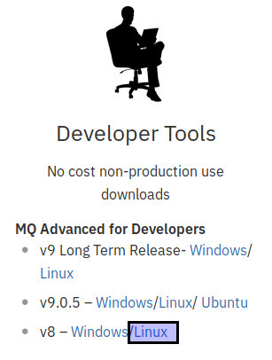

Una vez tengamos nuestra distro lista y como usuario **root** vamos a iniciar la instalación de los paquetes requeridos (Interfaz grafica X11 base, rpm, xauth)

```bash
 apt-get update &&  apt-get install rpm xorg xauth
```

Una vez realizada la instalación, creamos un usuario "mqm" el cual por defecto creara un grupo con el mismo nombre 

```bash
 adduser mqm
 passwd mqm
```

Paso seguido descomprimimos y desempaquetamos el componentes descargado de la pagina de IBM 

```bash
tar -xzvf mqadv_dev80_linux_x86-64.tar.gz
```

Ahora finalmente para realizar la instalación, accedemos al directorio que hemos descomprimido, aceptaremos la licencia y procedemos al proceso de instalación mediante los siguientes pasos.

```bash
cd MQServer
./mqlicense.sh -text_only
./crtmqpkg MQServer
cd /var/tmp/mq_rpms/MQServer/x86_64
sudo  rpm -ivh --force-debian --ignorearch MQSeries*.rpm 
```

Ahora ya se habra completado el proceso de instalación y el resto de las actividades se realizaran con el usuario mqm.


## B. QManager (Gestor de Colas)

Cuando se realiza el proceso de instalación no contamos con ningun componente, para esta guia crearemos un QManager o gestor de colas) nos permite definir una serie de colas, canales (como se comunican) y puertos para que aplicaciónes externas puedan conectarse. 

Para inciar con la creación de un QManager accedemos como el usuario mqm (con interfaz grafica) para poder iniciar la aplicación de Explorer de IBMMQ.

```bash
cd /opt/mqm/bin/
./MQExplorer
```

Una vez iniciada nos dirigimos al arbol y hacemos click derecho sobre "Gestor de Colas", seleccionado "Nuevo Gestor de Colas"

Le damos un nombre a este Gestor de Colas, en mi caso lo he llamado "QMANAGER_HELLO". Este nomre es importante ya que al crear nuestras colas, debemos indicar a que QManager pertenecen.

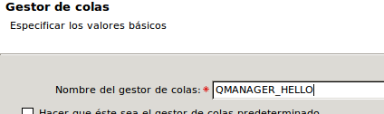


Pulsamos siguiente varias veces, hasta llegar a el punto donde indica que indiquemos el puerto para escuchar peticiones hacia el QManager (y por ende a las colas alojadas en el), para este he escogido el puerto "1515". Este puerto es importante ya que lo utilizaremos cuando estemos definiendo los archivos de configuración a exportar.


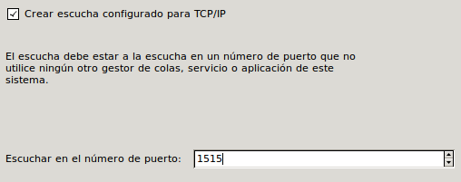


Una vez realizado esto pulsamos el boton "Finalizar" ya ya nuestro QManager ha quedado creado, pero todavia nos falta por configurar el Canal por el cual las colas van a llegar a nuestras colas, para esto dentro del QManager nos paramos en "Canales"

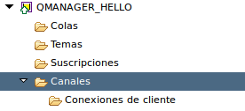


Hacemos click derecho y seleccionamos "Nuevo" y "Canal de Conexion con el Servidor". 

Seleccionamos un nombre para este canal, el cual en este documento he seleccioando "CH_HELLO" y pulsamos el boton "Finalizar".

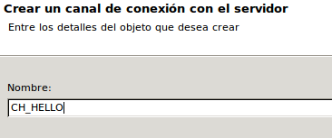


Ya con nuestra configuración lista, solo nos falta crear las colas (Parte C) y crear el archivo .binding que nos permitira realizar una aplicación de Weblogic para poder colocar mensajes en la cola y  


## C. Deshabilitar seguridad QManager 

Por defecto IBM MQ cuenta con una autenticación activa por defecto que fuerza a registrar que usuario puede conectarse a una cola de mensajeria. 

Para esto, cuando se realiza un intento de conexión se pasa el usuario que lanza el proceso (Java) desde el cliente y se envia a MQ. 

Realmente este paso no es una buena practica de realizarse, pero la haremos en este ambiente para evitar problemas  con errores 

```bash
JMSWMQ2013: La autenticación de seguridad que se suministró para QueueManager 'QMANAGER_HELLO' con modalidad de conexión 'Client' y nombre de host 'ibmmq(1515)' no era válida
```

Para realizar esto, accedemos al MQExplorer y hacemos click derecho sobre nuestro QManager "QMANAGER_HELLO" 


y seleccionamos "Propiedades" y seleccionamos "Comunicación". En la sección de "Comunicación" seleccionamos "Registros de autenticación de canal" y la dejamos "Inhabilitado".

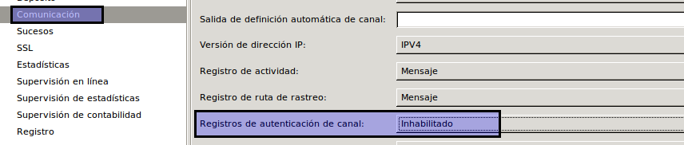


Una vez realizado esto, pulsamos el boton "Aplicar" y seleccionamos ahora en "Ampliación".

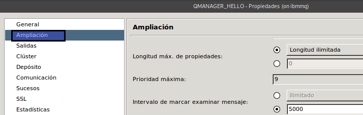


Una vez seleccionado buscamos "Autenticación de conexión" que se encuentra hasta el final y lo dejamos en blanco.

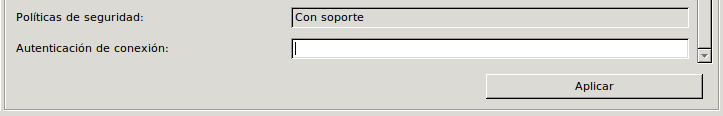


 Pulsamosa el boton "Aplicar" y finalmente Guardamos la configuración


## D. Crear Colas 

Para crear las colas y demas componentes podemos hacerlo por interfaz grafica, pero lo haremos por linea de comando.

Para iniciar con el llamado de las herramientas de linea de comando, necesitamos setear el ambiente de IBMMQ en nuestro sesión de trabajo para lo cual desde la linea de comando ejecutamos el comando 

```bash
mqm@ibmmq:~$ source /opt/mqm/java/bin/setjmsenv
MQ_JAVA_INSTALL_PATH is /opt/mqm/java
MQ_JAVA_DATA_PATH is /var/mqm
MQ_JAVA_LIB_PATH is /opt/mqm/java/lib
CLASSPATH is /opt/mqm/java/lib/com.ibm.mq.jar:/opt/mqm/java/lib/com.ibm.mqjms.jar:/opt/mqm/java/lib/com.ibm.mq.allclient.jar:/opt/mqm/samp/wmqjava/samples:/opt/mqm/samp/jms/samples
```

El cual define las variables requeridas para llamar los comandos.

Ahora invocaremos el comando "runmqsc" con el nombre del QManager en el cual deseamos crear las colas 

```bash
/opt/mqm/bin/runmqsc QMANAGER_HELLO
```

Esto nos deja en modo de terminal de IBMMQ para poder realizar operaciones sobre el QManager, para la creación de la cola que sera local utilizaremos el comando 

```bash
#Sintaxis
DEFINE QLOCAL (NOMBRE_COLA)
```

Creamos la cola local con el nombre "QUEUE_HELLO_WL"

```bash
DEFINE QLOCAL (QUEUE_HELLO_WL)
```

Finalmente escribimos end para terminar, asi pues veras lo siguiente en pantalla

```bash
mqm@ibmmq:~$ /opt/mqm/bin/runmqsc QMANAGER_HELLO
5724-H72 (C) Copyright IBM Corp. 1994, 2011. TODOS LOS DERECHOS RESERVADOS.
Se está iniciando MQSC para el gestor de colas QMANAGER_HELLO.


DEFINE QLOCAL (QUEUE_HELLO_WL)
     1 : DEFINE QLOCAL (QUEUE_HELLO_WL)
AMQ8006: Se ha creado la cola de WebSphere MQ.
end
     2 : end
Se ha leído un mandato MQSC.
Ningún mandato tiene un error de sintaxis.
Se han procesado todos los mandatos MQSC válidos.

```

## E. Crear .binding

El archivo de binding es un archivo que genera las herramientos de IBMMQ para poder pasar la configuración requerida para poder ser invocada por los clientes, evitando que estos escriban esta configuración dentro del codigo.

Para crear el binding para esta cola, vamos a definir un archivo que nos permite indicar la configuración de la herramienta (en donde describimos donde dejara el archivo)

Para esto creamos el archivo /home/mqm/MyAdmin.config con el siguiente contenido 

```bash
INITIAL_CONTEXT_FACTORY=com.sun.jndi.fscontext.RefFSContextFactory
PROVIDER_URL=file:///home/mqm
SECURITY_AUTHENTICATION=none
```

La parte mas importante de este archivo es "PROVIDER_URL", el cual le indicara a la herramienta que el binding quedara en el directorio "/home/mqm"

Paso seguido para poder crear el bindig haremos uso del nombramiento dos componentes claves 

1. La cola : La cual hemos llamado y creado previamente QUEUE_HELLO_WL, la cual esta dentro del Qmanager "QMANAGER_HELLO" y sera atendido por este por el puerto "1515" y usara el Canal "CH_HELLO"
1. La fabrica de Conexiones : La cual no hemos creado, pero la llamaremos "HELLO_WL.QCF" , la cual estara dentro del Qmanager "QMANAGER_HELLO" y sera atendido por este por el puerto "1515" y usara el Canal "CH_HELLO" y estara corriendo en mi maquina la cual se llama "ibmmq"
Con esta definición utilizaremos los comando de IBM MQ 
1. **def qcf** : Definimos una Fabrica de Conexiones
1. **def q** : Definimos la configuración de la Cola.
Y nuestro script quedara

```bash
def qcf(HELLO_WL.QCF) qmgr(QMANAGER_HELLO) HOST(ibmmq) PORT(1515) TRANSPORT(CLIENT) CHANNEL(CH_HELLO)
def q(QUEUE_HELLO_WL) qmgr(QMANAGER_HELLO) queue(QUEUE_HELLO_WL)
end
```


Ahora lancemos el cliente para generar el binding, para lo cual ejecutamos el comando 

```bash
/opt/mqm/java/bin/JMSAdmin -cfg /home/mqm/MyAdmin.config
```

Este nos deja en una linea de comando que inicia con "InitCtx>", el cual escribimos el script que hemos preparado y obteniendo como respuesta

```bash
mqm@ibmmq:~$ /opt/mqm/java/bin/JMSAdmin -cfg /home/mqm/MyAdmin.config

Material bajo licencia - Propiedad de IBM
5724-H72, 5655-R36, 5724-L26, 5655-L82
(c) Copyright IBM Corp. 2008, 2011 Reservados todos los derechos.
Derechos restringidos de los usuarios del Gobierno de los EE.UU.
- Utilización, duplicación o divulgación restringida por el GSA
ADP Schedule Contract con IBM Corp.
Iniciando la administración del servicio de mensajes de WebSphere MQ classes for Java(tm)

InitCtx> def qcf(HELLO_WL.QCF) qmgr(QMANAGER_HELLO) HOST(ibmmq) PORT(1515) TRANSPORT(CLIENT) CHANNEL(CH_HELLO)

InitCtx> def q(QUEUE_HELLO_WL) qmgr(QMANAGER_HELLO) queue(QUEUE_HELLO_WL)

InitCtx> end

Deteniendo la administración del servicio de mensajes de WebSphere MQ classes for Java(tm)
```


Ahora ya nuestro archivo binding se encuentra en la ruta /home/mqm

```bash
mqm@ibmmq:~$ ls -la /home/mqm/.bindings 
-rw-rw-r-- 1 mqm mqm 16030 jul 11 12:34 /home/mqm/.bindings
```

## F. Weblogic -> IBM MQ (App)

En esta sección crearemos dos componentes de aplicación 

1. Un MessageDriveBean (MDB) para leer mensajes de una Cola, la cual he llamado "jms/HelloQueue" (no debe llamarse igual a la que esta en MQ). La cual recibe un texto (TextMessage) y simplemente lo escribe con un System.out
1. Un Servlet que recibe un mensaje de texto y lo coloca en la cola de mensajeria "jms/HelloQueue", mediante una fabrica de conexiones "jms/HelloQueue" (no debe llamarse igual a la que esta en MQ)

**Codigo del MessageDriveBean** 

```java
@MessageDriven(
		activationConfig = { 
				@ActivationConfigProperty(propertyName = "destinationType", propertyValue = "javax.jms.Queue"), 
				@ActivationConfigProperty(propertyName = "destination", propertyValue = "jms/HelloQueue")
		}, mappedName = "jms/HelloQueue")
@TransactionAttribute(TransactionAttributeType.NOT_SUPPORTED)
public class ColaReceptora implements MessageListener {
    public void onMessage(Message message) {
    	try {
    		if (message instanceof TextMessage) {
    			TextMessage txtMessage= (TextMessage)message;
    			System.out.println("[MENSAJE][" + txtMessage.getText() + "]");
    		}else {
    			throw new Exception(" message o es un TextMessage " + message.getClass().getName() );
    		}
    	}catch (Exception ex) {
    		System.out.println("Error : " +ex.getMessage());
    	}
    }
}
```

**Codigo del Servlet**

```java
/**
 * @see HttpServlet#service(HttpServletRequest request, HttpServletResponse response)
 */
protected void service(HttpServletRequest request, HttpServletResponse response) throws ServletException, IOException {
	String textMessage= request.getParameter("txtMessage");
	try { 
		enviarMensaje(textMessage);
		System.out.println("Exito por AUTO_ACKNOWLEDGE");
	}catch (Exception ex) { System.out.println("Error " + ex.getMessage()); ex.printStackTrace();}
	
	
}

private void enviarMensaje(String txtMessage) throws Exception{
	InitialContext ctx = null;
	try {
		ctx= new InitialContext();
		qcf = (QueueConnectionFactory)ctx.lookup("jms/HelloQCF");
		qc = qcf.createQueueConnection();
		qsess = qc.createQueueSession(false, Session.AUTO_ACKNOWLEDGE);
		q = (Queue) ctx.lookup("jms/HelloQueue");
		qsndr = qsess.createSender(q);
		message= qsess.createTextMessage();
		message.setText(txtMessage);
		qsndr.send(message);
	}finally {
		try {
			qsndr.close();
		} catch (JMSException e) { }
		try {
			qsess.close();
		} catch (JMSException e) { }
		try {
			qc.close();
		} catch (JMSException e) { }
	}
	
}	
```

Finalmente es importante en la definición de la cola la configuración de weblogic-ejb-jar.xml

**Codigo del weblogic-ejb-jar.xml**
```bash
<?xml version="1.0" encoding="UTF-8"?>
<wls:weblogic-ejb-jar xmlns:wls="http://xmlns.oracle.com/weblogic/weblogic-ejb-jar" xmlns:xsi="http://www.w3.org/2001/XMLSchema-instance" xsi:schemaLocation="http://java.sun.com/xml/ns/javaee http://java.sun.com/xml/ns/javaee/ejb-jar_3_1.xsd http://xmlns.oracle.com/weblogic/weblogic-ejb-jar http://xmlns.oracle.com/weblogic/weblogic-ejb-jar/1.7/weblogic-ejb-jar.xsd">
    <!--weblogic-version:12.2.1.3-->
    <wls:weblogic-enterprise-bean>
        <!--options:DESTINATION_JNDI-->
        <wls:ejb-name>ColaReceptora</wls:ejb-name>
        <wls:message-driven-descriptor>
            <wls:destination-jndi-name>jms/HelloQueue</wls:destination-jndi-name>
            <wls:connection-factory-jndi-name>jms/HelloQCF</wls:connection-factory-jndi-name>
        </wls:message-driven-descriptor>
        <wls:jndi-name>jms/HelloQueue</wls:jndi-name>
    </wls:weblogic-enterprise-bean>
</wls:weblogic-ejb-jar>
```

## G. Configurando Weblogic (paso 1)

La integración  entre estos dos sistemas se realiza mediante una configuración conocida en Weblogic como Servidor Ajeno, el cual indicara que las colas que este busca se encuentran en otro servidor diferente.

Para este caso utilizare la version Weblogic 12.2.1.3 instalado mi maquina con el usuario "jgaviria" (veremos que el usuario es importante por tema de permisos en IBMMQ), en el directorio de instalación 

```java
/data/servers/weblogic12.2.1.3/domains/dev_domain/
```

Ahora bien iniciaremos con el proceso de configuración de nuestro dominio, para lo cual primero vamos a copiar los archivos de configuración y librerias de IBMMQ. 

- **Copiar el archivo .binding** : Creamos el directorio de trabajo jndi (puede ser cualquier directorio) en el cual copiaremos nuestro archivo de bindig para lo cual ejecuto los siguientes pasos. 
```bash
#Creo y accedo al directorio
cd /data/servers/weblogic12.2.1.3/domains/dev_domain/
mkdir jndi
cd jndi/
#Copio del servidor "ibmmqm" el archivo .bindings y lo dejo en el directorio
scp mqm@ibmmq:/home/mqm/.bindings .
```

- **Copiamos las librerias** : Para poder realizar la conexion entre un cliente e IBMMQ, se requieren una serie de librerias la cuales copiaremos dentro del directorio "lib" del dominio, las librerias a copiar son 
```bash
com.ibm.mq.allclient.jar
com.ibm.mq.jar
com.ibm.mqjms.jar
fscontext.jar
providerutil.jar
```

Y pueden ser descargadas desde el servidor IBMMQ (ya que se encuentran en el directorio /opt/mqm/java/lib/) mediante los siguientes comando 

```bash
cd /data/servers/weblogic12.2.1.3/domains/dev_domain/lib
scp mqm@ibmmq:/opt/mqm/java/lib/com.ibm.mq.allclient.jar .
scp mqm@ibmmq:/opt/mqm/java/lib/com.ibm.mq.jar .
scp mqm@ibmmq:/opt/mqm/java/lib/com.ibm.mqjms.jar .
scp mqm@ibmmq:/opt/mqm/java/lib/fscontext.jar .
scp mqm@ibmmq:/opt/mqm/java/lib/providerutil.jar .
```

## H. Configurando Weblogic (paso 1)
Para esta segunda parte, vamos a realizar la configuración usando la consola de administración del dominio por lo cual accedemos a la URL 

http://127.0.0.1:7001/console

Una vez hayamos ingresado con nuestro usuario y contraseña, crearemos un nuevo Modulo JMS para definir la configuración de nuestras colas de mensajeria que se integraran con IBM MQ.

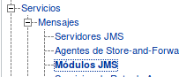

Ahora pulsamos el boton "Nuevo" para crear un nuevo modulo JMS el cual tendra como nombre "HelloModuleJMS", este nombre es simplemente informativo y no tendra ninguna repercución dentro del proceso.

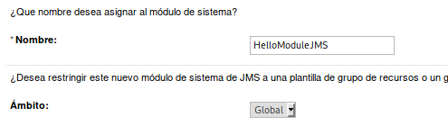

Paso seguido, pulsamos el boton "Siguiente" y seleccionamos el servidor manejado en el cual este modulo estara disponible" y finalmente pulsamos el boton "Siguiente". Y marcamos el campo de chequeo "Desea agregar recursos a este módulo de sistema de JMS?" para iniciar con el proceso de creación de los recursos para integrarse con IBM MQ


Ahora realizaremos la creación de un recursos conocido como "Servidor Ajeno", para esto pulsamos el boton "Nuevo" y seleccionamos "Servidor Ajeno" y pulsamos el boton "Siguiente"


Una vez en esta hacemos click en siguiente seleccionamos un nombre para este servidor ajeno, para este documento lo nombrare "HelloServidorAjeno" (este nombre es simplemente descriptivo y no tiene impacto en el proceso)


Una vez realizado esto hacemos click en "Siguiente" y seleccionamos el servidor al cual estara asociado este servidor ajeno. Finalmente pulsamos el boton "Terminar"

Ahora dentro de la configuración del Servidor ajeno modificaremos los campos de "Fábrica de Contexto Inicial de JNDI" y "URL de Conexión de JNDI", por los siguientes valores

**Fábrica de Contexto Inicial de JNDI** : com.sun.jndi.fscontext.RefFSContextFactory
**URL de Conexión de JNDI :** file:///data/servers/weblogic12.2.1.3/domains/dev_domain/jndi

Como se presenta en la imagen

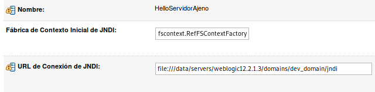

Ahora pulsamos el boton de Grabar y realizaremos la configuración de la cola y la fabrica de Conexiones, en este punto debemos enfocarnos en los dos Tabs localizados en la consola d Administración en los cuales 
Destinos : Hace referencia a las colas de mensajeria
Fabricas de Conexiones : Hace referencia a la fabria de conexiones.

Debemos tambien tener en cuenta los nombre que estos tanto en Weblogic (usados en el programa) como en los definidos dentro del MQ. 

**Para Weblogic (App)**
**Nombre de la cola :** jms/HelloQueue
**Nombre de la Fabrica de Conexiones :** jms/HelloQCF

**Para IBM MQ**
**Nombre de la cola :** QUEUE_HELLO_WL
**Nombre de la Fabrica de Conexiones :** HELLO_WL.QCF


**Creamos primero la cola** 
El nombre es de proposito informativo, pero el nombre Local hace referencia al que usara Weblogic y el remoto a como se encuentra definida dentro de IBMMQ

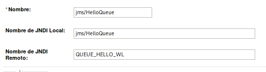

Pulsamos Ok y ahora creamos nuestro proximo recurso, la fabrica de conexiones

**Creamos la fabrica de Conexiones**
El nombre es de proposito informativo, pero el nombre Local hace referencia al que usara Weblogic y el remoto a como se encuentra definida dentro de IBMMQ


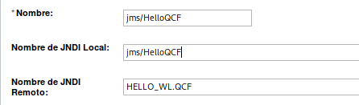


Pulsamos Ok y con esto hemos terminado nuestra configuración.

Ahora si llegamos a correr nuestro aplicativo se vera un error 
```bash
JMSWMQ2013: La autenticación de seguridad que se suministró para QueueManager 'QMANAGER_HELLO' con modalidad de conexión 'Client' y nombre de host 'ibmmq(1515)' no era válida
```

Esto debido a que estamos intentando acceder al QManager con el usuario que lanzo el proceso de Weblogic (en mi caso jgaviria), el cual no esta creado en MQ


## I. Logs de Libreria

Para ver todo el detalle de errores en IBM MQ, simplemente adicionamos los argumentos de entrada las lineas

```bash
-Dcom.ibm.msg.client.commonservices.trace.status=ON 
-Dcom.ibm.msg.client.commonservices.trace.outputName=ibmmq.log
```

Esto creara el archivo ibmmq.log en la raiz del dominio con todo el trafico de mensajes hacia el MQ.


